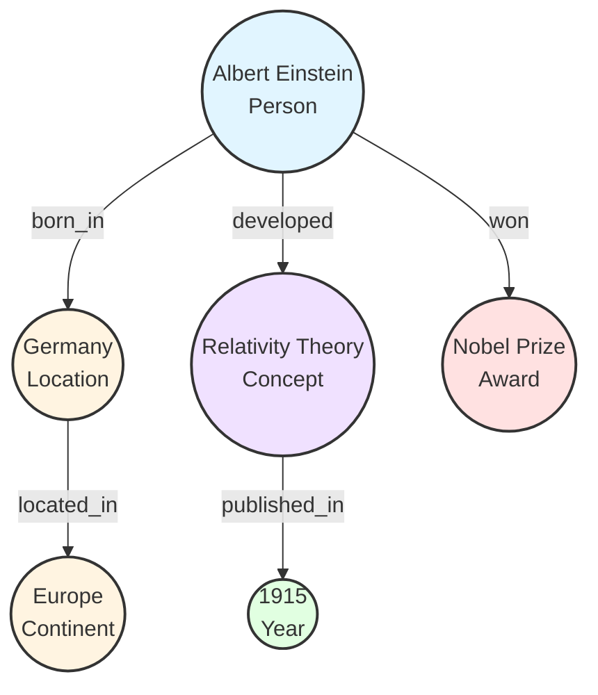

```mermaid
graph TD
    AE((Albert Einstein<br/>Person))
    G((Germany<br/>Location))
    E((Europe<br/>Continent))
    RT((Relativity Theory<br/>Concept))
    NP((Nobel Prize<br/>Award))
    Y((1915<br/>Year))
    
    AE -->|born_in| G
    G -->|located_in| E
    AE -->|developed| RT
    AE -->|won| NP
    RT -->|published_in| Y
    
    style AE fill:#e1f5ff,stroke:#333,stroke-width:2px
    style G fill:#fff4e1,stroke:#333,stroke-width:2px
    style E fill:#fff4e1,stroke:#333,stroke-width:2px
    style RT fill:#f0e1ff,stroke:#333,stroke-width:2px
    style NP fill:#ffe1e1,stroke:#333,stroke-width:2px
    style Y fill:#e1ffe1,stroke:#333,stroke-width:2px
```